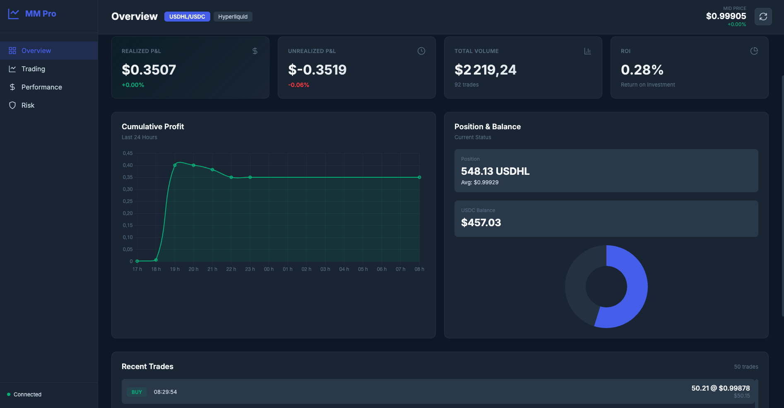

# Hyperliquid Stablecoin Market Maker

Automated market making bot for USDHL/USDC on Hyperliquid with real-time dashboard.



## Features

- **Smart Market Making**: Inventory-aware pricing with dynamic spread adjustment
- **Incremental Selling**: Sells in tranches to maximize profit
- **Average-Down Protection**: Only buys below current average cost
- **Real-time Dashboard**: Flask-based web UI with performance metrics
- **Persistent Storage**: SQLite database for trade history and analytics
- **Docker Support**: Single-container deployment

## Quick Start

### 1. Setup Environment

```bash
cp .env.example .env
# Edit .env with your Hyperliquid credentials
```

### 2. Run with Docker

```bash
docker-compose up -d
```

### 3. Access Dashboard

```
http://localhost:5000
```

## Configuration

Edit `main.py` to adjust strategy parameters:

| Parameter | Default | Description |
|-----------|---------|-------------|
| `ORDER_SIZE` | 100 | Base order size in USDHL |
| `MAX_POSITION` | 1000 | Maximum inventory limit |
| `MIN_SPREAD_BPS` | 3 | Minimum spread to trade (0.03%) |
| `SELL_TRANCHES` | 4 | Number of sell levels |
| `ONLY_AVERAGE_DOWN` | True | Only buy below average cost |

## Architecture

```
main.py              → Market maker bot (trading logic)
dashboard_api.py     → Flask API + web server
market_maker.db      → SQLite database (trades, positions, metrics)
templates/           → Dashboard HTML
static/              → CSS/JS assets
```

## API Endpoints

- `GET /api/stats` - Current position and P&L
- `GET /api/trades/recent` - Latest 50 trades
- `GET /api/performance/stats` - Win rate, profit factor, ROI
- `GET /api/market/spread` - Spread analysis
- `GET /api/system/health` - Bot health status

## Database Schema

**trades**: Trade history with P&L tracking  
**position_snapshots**: Inventory over time  
**market_snapshots**: Spread and depth data  
**order_events**: Order lifecycle logs  

## Requirements

- Python 3.9+
- ccxt >= 4.0.0
- Flask >= 3.0.0
- Docker (optional)

## Manual Installation

```bash
pip install -r requirements.txt

# Terminal 1: Run bot
python main.py

# Terminal 2: Run dashboard
python dashboard_api.py
```

## Safety Features

- **Position Limits**: Enforced max inventory
- **Spread Validation**: Won't trade if spread too narrow
- **Fee Accounting**: Includes maker fees in cost basis
- **Order Management**: Smart requoting to minimize API calls
- **Database Persistence**: Recovers state on restart

## Monitoring

View logs:
```bash
docker-compose logs -f
```

Check health:
```bash
curl http://localhost:5000/api/system/health
```